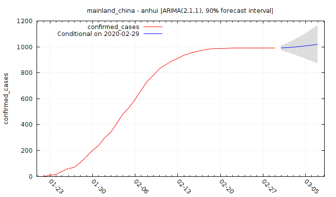
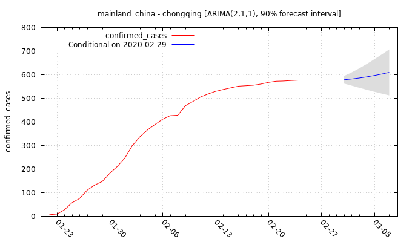

# covid_19_forecast

Data provided by the Johns Hopkins University Center for Systems Science and Engineering (JHU CCSE) can be found here:
https://github.com/CSSEGISandData/COVID-19

The gretl code can be executed by two ways:
Option A:

	1) Clone the repo
	2) open ./script/run.inp
	3) Set your project path by setting the variable "DIR_WORK" accordingly
	4) Execute

Option B:

	1) Clone the repo
	2) Execute the shell-script run.sh

The script downloads the latest CCSE-data, processes the raw data for obtaining a clean panel data set.
Next, for each country-province combination two exercises are conducted:

	1) Expost forecasting analysis by restricting the training set to <CURRENT_DATE - MAX_HORIZON> where "CURRENT_DATE" refers to latest date for which data is available, and "MAX_HORIZON" is the set multi-step forecast horizon (default 7 days).
	2) Exante forecasting analysis for the forthcoming "MAX_HORIZON" days.

The chosen forecasting method is of the ARIMA(p,d,q)-type. The default is an ARIMA(2,1,1) model but the user can set parameters of choice. For all forecasting exercises, 90% forecast intervals will be computed.

# Up-to-date out-of-sample 7-days ahead forecasts

 

